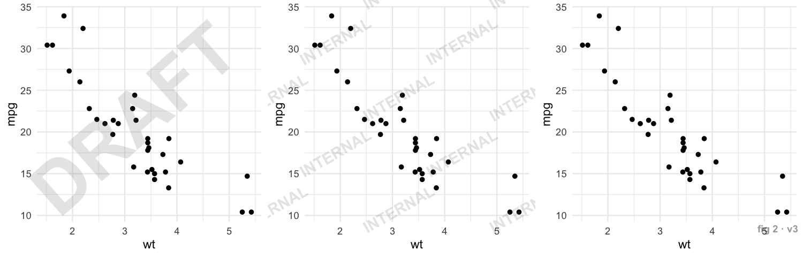
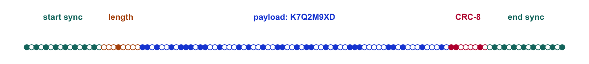

<!-- README.md is generated from README.Rmd. Please edit that file -->

# watermark 

<!-- badges: start -->

[](https://github.com/despresj/watermark/actions/workflows/R-CMD-check.yaml)
[](https://github.com/despresj/watermark/actions/workflows/robustness.yaml)
[](https://github.com/despresj/watermark/actions/workflows/test-coverage.yaml)
[](https://lifecycle.r-lib.org/articles/stages.html#experimental)
[](https://github.com/despresj/watermark/blob/main/LICENSE.md)
<!-- badges: end -->

**Get from a stray screenshot back to the run that made it.**

Charts escape. They get screenshotted into slide decks, pasted into
Slack, re-saved as JPEGs and forwarded until nobody knows which script,
which data pull, or which version produced them. watermark stamps each
plot with a short ID you can read back out of the pixels, even after all
of that. Log the ID when you save the plot, and any copy leads back to
its run, code and data.

<p align="center">

<picture>
<source media="(max-width: 640px)" srcset="man/figures/lineage-mobile.gif" />

</picture>
</p>

<p align="center">

<sub>A screenshot arrives with no context. <b>Left:</b> six questions,
no answers. <b>Right:</b> <code>extract_watermark()</code> reads the ID
out of the same JPEG (the strip is its own pixels around the dot row,
magnified), and the ID finds the row logged in <code>plots.csv</code>
when the plot was saved. Only the ID is in the pixels; everything else
comes from that log, with the client, project and run as demo values.
The decode is real: made and checked by
<a href="https://github.com/despresj/watermark/blob/main/data-raw/lineage-demo.R"><code>data-raw/lineage-demo.R</code></a>.
<a href="https://github.com/despresj/watermark/blob/main/man/figures/lineage-still.png">Still image</a> ·
<a href="https://github.com/despresj/watermark/blob/main/man/figures/lineage-mobile.gif">Phone-sized version</a></sub>
</p>

## Installation

``` r
# install.packages("pak")
pak::pak("despresj/watermark")
```

## Thirty-second tour

``` r
library(ggplot2)
library(watermark)

p <- ggplot(mtcars, aes(wt, mpg)) +
  geom_point() +
  watermark_dots("RUN-42")          # just another + component

file <- tempfile(fileext = ".png")
ggsave(file, p, width = 7, height = 5, dpi = 150)

extract_watermark(file)
#> [1] "RUN-42"
```

Now abuse it. Shrink it by half, pad it with window chrome like a
screenshot, and push it through JPEG at quality 50:

``` r
img <- png::readPNG(file)
abused <- tf_jpeg(tf_pad(tf_resize(img, 0.5), 40), quality = 50)

extract_watermark(abused)
#> [1] "RUN-42"
```

<sup>`tf_resize()`, `tf_pad()` and `tf_jpeg()` are the image transforms
from the package’s [stress-test
suite](https://github.com/despresj/watermark/blob/main/tests/testthat/helper-transforms.R).</sup>

## Three kinds of watermark

|  | What it is | Survives screenshots | Carries | Use it for |
|----|----|:--:|----|----|
| `watermark_dots()` | A faint row of dots in the bottom margin | ✅ | A short ID (up to 16 bytes) | Tracing any copy back to its source |
| `watermark_text()` | A visible stamp: diagonal, tiled, or corner | ✅ | Whatever you write | Deterring reuse: `"DRAFT"`, `"CONFIDENTIAL"` |
| `ggsave_watermark()` | Dots **plus** PNG metadata | Dots only | ID, timestamp, title, versions, any fields you add | The full provenance record for the original file |

All three are drawn relative to the whole figure, never the data. They
don’t touch your scales, axes, coordinate system or facets, and they
work the same on `coord_flip()`, `coord_polar()`, `facet_wrap()` and
discrete axes.

### Visible stamps

``` r
base <- ggplot(mtcars, aes(wt, mpg)) + geom_point() + theme_minimal()

stamps <- list(
  base + watermark_text("DRAFT"),
  base + watermark_text("INTERNAL", position = "tile"),
  base + watermark_text("fig 2 · v3", position = "bottomright")
)
```



Visible text stays out of the strip reserved for the dot code, so you
can stack a stamp and the dots in any order.

### Provenance on save

`ggsave_watermark()` is a drop-in for `ggsave()`. It adds the dots and
writes a provenance record into the PNG itself:

``` r
id <- ggsave_watermark(
  file,
  ggplot(mtcars, aes(wt, mpg)) + geom_point() + labs(title = "Weight vs MPG"),
  metadata = list(script = "analysis/fig2.R", commit = "9f3c2e1"),
  width = 7, height = 5, dpi = 150
)

str(read_watermark_metadata(file))
#> List of 6
#>  $ id      : chr "W0GP5FZ7"
#>  $ created : chr "2026-09-29T20:23:11-0400"
#>  $ title   : chr "Weight vs MPG"
#>  $ software: chr "R 4.6.1; ggplot2 4.0.3; watermark 0.1.0"
#>  $ script  : chr "analysis/fig2.R"
#>  $ commit  : chr "9f3c2e1"
```

Metadata is rich but fragile: a screenshot throws it away. The dots are
terse but tough. Together you get the full record when the original file
travels and the ID when only the pixels do.

### Tracing a screenshot back

The dots carry only the ID, so keep a record of what each ID means: a
row in a CSV file, a database table, a lab notebook. When a copy turns
up with no context, read its ID and look it up:

``` r
plots_csv <- tempfile(fileext = ".csv")
write.csv(
  data.frame(id = id, script = "analysis/fig2.R", commit = "9f3c2e1",
             data = "snapshot-2026-09-12.csv"),
  plots_csv, row.names = FALSE
)

screenshot <- tf_jpeg(tf_pad(tf_resize(png::readPNG(file), 0.6), 30),
                      quality = 60)

plots <- read.csv(plots_csv)
plots[plots$id == extract_watermark(screenshot), ]
#>         id          script  commit                    data
#> 1 W0GP5FZ7 analysis/fig2.R 9f3c2e1 snapshot-2026-09-12.csv
```

``` r
wm_id()     # 8 chars of Crockford base32 (40 bits); never I, L, O or U
#> [1] "0BCCWC55"
wm_uuid()   # for metadata; too long for the dots
#> [1] "36c4046c-e0e9-49d8-aaa5-faf325042606"
```

IDs come from a private random stream. `set.seed()` in your analysis
won’t repeat them, and generating them won’t disturb your seed.

## How the dot code works



Each dot position is one bit; a dot means 1, a gap means 0. The frame
is:

- **Start sync**, `1010…`: eight evenly spaced dots. The decoder uses
  them to lock on and measure the pitch, so it doesn’t care about image
  size.
- **Header**: the ID’s length, and whether it’s packed. IDs made only of
  `wm_id()`’s 32 characters take 5 bits each; any other string is stored
  as UTF-8 bytes.
- **Payload**, then a **32-bit check**: two CRC-16s over the header and
  ID.
- **End sync**, `…0101`. The frame’s first and last bits are both 1, so
  the outermost dots mark the frame edges.

Decoding scans the image row by row. It compares pixels with their local
neighbourhood (so borders and UI chrome don’t confuse it), locks onto
the start sync, and reads each bit by interpolating between pixels, with
the threshold set by how the sync dots actually read. Rows too faint to
read alone are averaged with their neighbours. As a last resort it reads
the frame where `watermark_dots()` always draws it, a fixed fraction of
the way across the figure, which rescues images too small or compressed
to find the dots one by one.

A row is accepted only if both syncs, the header and the 32-bit check
all agree. A damaged frame slips past that about once in four billion
readings, so a decode is exact or `NULL`: it doesn’t guess.

## How tough is it?

A 7 × 5 in plot saved at 150 dpi, pushed through 36 transformations.
Every row is recomputed each time this README is knit, and the same
matrix runs in
[`test-robustness.R`](https://github.com/despresj/watermark/blob/main/tests/testthat/test-robustness.R)
on every push, on several plot types.

|  | Transformation | Pixels | Dot code |
|:---|:---|---:|:---|
| Lossless | Original PNG | 1050 × 750 | ✅ recovered |
|  | PNG re-save | 1050 × 750 | ✅ recovered |
| Compression | JPEG quality 95 | 1050 × 750 | ✅ recovered |
|  | JPEG quality 75 | 1050 × 750 | ✅ recovered |
|  | JPEG quality 50 | 1050 × 750 | ✅ recovered |
|  | JPEG quality 25 | 1050 × 750 | ✅ recovered |
|  | JPEG q75, re-encoded 10 times | 1050 × 750 | ✅ recovered |
|  | JPEG -\> PNG -\> JPEG | 1050 × 750 | ✅ recovered |
| Resize | Downscale to 75% | 788 × 562 | ✅ recovered |
|  | Downscale to 50% | 525 × 375 | ✅ recovered |
|  | Upscale 2x (retina) | 2100 × 1500 | ✅ recovered |
|  | Odd scale 0.83x | 872 × 622 | ✅ recovered |
|  | Downscale to 640 px wide | 640 × 457 | ✅ recovered |
| Crop & frame | Crop top 30% | 1050 × 525 | ✅ recovered |
|  | Pad with light UI chrome | 1170 × 870 | ✅ recovered |
|  | Pad with dark UI chrome | 1170 × 870 | ✅ recovered |
|  | Screenshot chain (2x, pad, 0.5x, JPEG 80) | 1130 × 830 | ✅ recovered |
| Colour | Brightness +5% | 1050 × 750 | ✅ recovered |
|  | Contrast 70% | 1050 × 750 | ✅ recovered |
|  | Gamma 1.8 | 1050 × 750 | ✅ recovered |
|  | Grayscale | 1050 × 750 | ✅ recovered |
|  | Inverted (dark mode) | 1050 × 750 | ✅ recovered |
|  | Posterize to 32 levels | 1050 × 750 | ✅ recovered |
| Degrade | Gaussian noise sd 0.01 | 1050 × 750 | ✅ recovered |
|  | Box blur radius 1 | 1050 × 750 | ✅ recovered |
|  | Social re-share (0.6x, JPEG 70, x3) | 630 × 450 | ✅ recovered |
| Small + compressed | Shrink to 520 px wide + JPEG 35 | 520 × 371 | ✅ recovered |
|  | Shrink to 430 px wide + JPEG 50 | 430 × 307 | ✅ recovered |
|  | Shrink to 360 px wide + JPEG 50 | 360 × 257 | ✅ recovered |
| Past the limits | Crop bottom 5% | 1050 × 713 | ✖ not found |
|  | Crop left 10% | 945 × 750 | ✖ not found |
|  | Rotate 90 degrees | 750 × 1050 | ✖ not found |
|  | Brightness +15% (dots clip to white) | 1050 × 750 | ✖ not found |
|  | JPEG quality 5 | 1050 × 750 | ✖ not found |
|  | Shrink to 300 px wide + JPEG 50 | 300 × 214 | ✖ not found |
|  | Downscale to 25% | 262 × 188 | ✅ recovered |

**30 of 36 recovered exactly, and 0 wrong IDs.** The rows under “past
the limits” mark where the guarantee ends. A result there is either
exact or nothing:

- **The dot strip must survive.** Cropping the bottom edge or either
  side removes part of the frame; there is no partial recovery.
- **No rotation.** Rows are scanned horizontally.
- **Minimum size.** This 8-character ID decodes reliably down to about
  **250 px wide**, and sometimes lower. Shorter IDs go further; 16-byte
  IDs need about twice the width.
- **Compression.** At full size, JPEG holds down to about **quality
  15**.
- **Small *and* compressed.** The two limits compound. JPEG holds to
  quality 35 down to about 520 px wide and to quality 50 down to about
  360 px; around 300 px, the dots themselves start losing bits to
  compression.
- **Brightening past about +8%** clips the faint dots to white. Raise
  `alpha` if your plots will be edited heavily.

Watermarks here are for provenance, not security. Anyone who knows the
dots are there can crop or paint over them. The point is that ordinary
sharing doesn’t destroy them.

## Related work

- [ggplot2](https://ggplot2.tidyverse.org), which this extends.
- Steganography packages hide data in the least significant bits of
  pixels, which a single JPEG pass or screenshot destroys. watermark
  trades capacity for survival.

## Contributing

Bug reports and ideas are welcome in the [issue
tracker](https://github.com/despresj/watermark/issues). Run the test
suite with `devtools::test()`; the robustness matrix lives in
`tests/testthat/test-robustness.R`.
